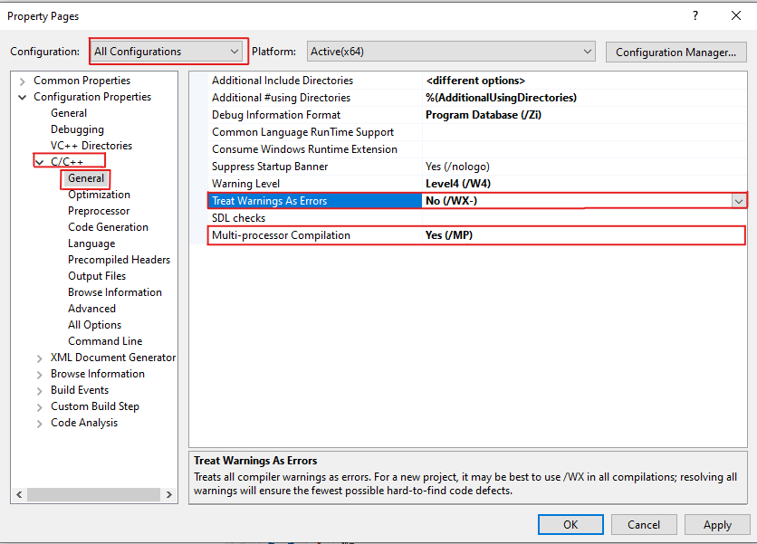

# Grand Theft Auto V: Source Code Build Guide *For PC*

## Requirements

- Latest Grand Theft Auto V Files from Steam, Epic Games or Rockstar Games Launcher
   - Cracked version do not work unless you watch [these steps.](#getting-cracked-copies-work)    
- GTAVSP.7z - Source Code  
   - SHA1 Hash: `ca39323730ed644fa534a2946506d4287f92a799`
   - Password: `Mi76#b>9mRed`
- [7-Zip](https://www.7-zip.org/)
- [GTA V Source Code Toolset](https://pixeldrain.com/u/2XdabBq3)
- [GTA V - PC 2699 Update RPF files](https://pixeldrain.com/u/donYCsxq) (For full debug and script support)
  - Or [with Pre Build Scripts](https://pixeldrain.com/u/MMsym3kN) if you dont want to build them
- Optional are also [Pre Build Shaders](https://pixeldrain.com/u/vAvUVD8B)

## Installing the Toolset

**You should deactivate your Anti-virus protection before doing any of the next steps.**

1. Run `Install_Toolset.bat`

#### Visual Studio 2012

   - At `Optional features to install`: only select `Microsoft Foundation Classes for C++`

#### IncrediBuild

   - At `Welcome` select `Install IncrediBuild`
   - At `Component Selection` select IncrediBuild Agent and IncrediBuild Coordinator
   - Do not change any other settings

#### .Net Framework 3.5

   - If the installer freezes:
     - Go to `Installation_Files\3. .Net Framework 3.5 Installer\Source Files`
     - Copy `setup.bat` to `3. .Net Framework 3.5 Installer` and run it as administrator

#### DirectX SDK (June 2010)

   - If you get `error S1023`:
     - Uninstall Visual C++ 2010 Redistributable
     - Reinstall DirectX SDK (June 2010)
   - At `Help Improve the DirectX SDK` select `No, I would not like to participate`

#### Helix-Core-Server

   - Don't change the port
   - For path, just select any empty folder

## Creating X:\ Drive

1. Create a new folder anywhere you want  
2. Inside the folder, create a folder called `gta5`  
3. Copy all content from `GTAVSP.7z/GTAV Source` folder to `gta5`  
4. Copy the two bat files from the [`GTA V - X Drive Batch files`](GTA%20V%20-%20X%20Drive%20Batch%20Files) folder to your "GTA" folder  
5. Run `Connect_X_Drive.bat`  
6. Right-click on the gta5 folder, turn off the "Read-Only" option, then press "Apply"

## Patching Source Code and Tools

1. Add all files from [`GTA V - Source Code Patches/PC`](GTA%20V%20-%20Source%20Code%20Patches/PC) to `X:\gta5\src\dev_ng`  
2. Choose if you want  
   - `patch_source_v2699.bat` RECOMMENDED – Standard version 2699 build, fully compatible with scripts.  
   - Or `patch_source_RETAIL_ONLY_v3407-3521.bat` Use this for a retail-like build (supports game versions 3407 to 3521, and possibly some later versions). NOTE: This version does NOT support scripts or debugging tools.  
3. Run your chosen .bat file.  
   - WARNING: This action is NOT reversible.  
   - If you change your mind later, you will need to delete your current source code copy and set up a new one.  
4. Run `X:\gta5\src\dev_ng\All_In_One_Install_Environment_Variables.bat`  
5. Run `X:\gta5\src\dev_ng\setenv.bat`
6. Copy all folders from [`dll_patches_x.zip`](GTA%20V%20-%20Source%20Code%20Patches/tools%20patch) to `X:\gta5\tools_ng\bin`, ensuring you overwrite existing files.

## Building Game Binaries/Executable

1. Run `X:\gta5\src\dev_ng\game\VS_Project\load_sln_unity_2012.bat`

<div style="text-align:center;">

</div>

- A warning will show in the Command Prompt Window stating you are missing an SDK, please ignore it and press any key to continue and open it with Visual Studio 2012.

<div style="text-align:center;">

</div>

- If you are promoted with `Choose Default Environment Settings` Select `General Development Settings` and at `Local Help Documentation` select `None`.

<div style="text-align:center;">

</div>

2. Once the solution loads, open the drop down menu that says `Debug` at the top, select `Configuration Manager`

<div style="text-align:center;">

</div>

3. Change `Active Solution Platform` to `x64` and `Active Solution Configuration` to `BankRelease` then close the configuration window.
  - You can change `Active Solution Configuration` to anything you want all will compile but this guide focuses on running the `BankRelease`.

<div style="text-align:center;">

</div>

4. Hold Ctrl key and select all projects under `GameLibs`, `Rage` and `game` folder, right-click and select `Properties`.

<div style="text-align:center;">

</div>

5. In the „Configuration” drop down, select „All Configurations”.
   - Select `C/C++ >General”, and set „Treat Warnings as Errors` to `No (/WX-)`.
   - For faster compiles set `Multiprocessor Compilation` to `Yes (/MP)`.
   - Then click `Apply` and `OK`.
   - If you get the error `C1060: Compiler is out of heap space` during build, turn off `Multiprocessor Compilation`.

<div style="text-align:center;">

</div>

6. At the top of the window, select `Build > Build Solution` and wait for build to finish.

<div style="text-align:center;">

</div>

7. Output folder is: `X:\gta5\titleupdate\` there you will find your compiled executable move it to your game directory.
## Patch the Game

The game needs to be modified slightly to run the compiled build, as mentioned above.

#### - If you don't want to compile shaders:
1. Open [`common.zip`](https://pixeldrain.com/u/vAvUVD8B) and extract the file.
2. Copy the extracted common folder to your game directory.

#### - If you want to compile shaders follow [these steps](#building-shaders)

#### - If you don't want to build scripts (Note: Retail patches do not support scripts):
- 2699 Build:
  1. Extract [`v2699 - 1.61 + Prebuild Scripts.7z`](https://pixeldrain.com/u/MMsym3kN).
  2. Copy both files from this archive to the update folder in the game directory.
- Retail Patched Build:
  1. Make sure you're using `update.rpf` and `update2.rpf` from version 3407 to 3521, or possibly some later versions.

#### - If you want to build the scripts yourself (2699 Build Only):
1. Extract [`v2699 - 1.61.7z`](https://pixeldrain.com/u/donYCsxq).
2. Copy both files from this archive to the update folder in the game directory.

## Getting Cracked Copies Work 

- Go to [`GTA V - PC Build Required Files/GTA V - Cracked Game Patch`](GTA%20V%20-%20PC%20Build%20Required%20Files/GTA%20V%20-%20Cracked%20Game%20Patch) folder  
- Copy everything inside of it to your game folder.

## Building Shaders

Optional: For multicore compilation, go to `X:\gta5\tools_ng\etc\RageShaderManager` and, in all .xml files, change every instance of `SingleCore=` to `"false"`.

1. Run `X:\gta5\src\dev_ng\game\VS_Project\load_sln_unity_2012.bat`
2. Under `Shaders`, right click the `shaders_rc` project and click `Build`

- (OPTIONAL) Build low quality shaders
  1. Right click the `shaders_rc` project and click `Properties`
  2. Select `Configuration Properties > NMake`
  3. Under `General`, change all command lines from ending with `win32_40.bat` to ending with `win32_40_lq.bat`, then click `Apply` and `OK`
  4. Rebuild shaders and wait for it to finish

To see the progress and watch its status, in the taskbar, open the Overflow Menu (the small ^ in the taskbar on the right).
Find `IncrediBuild Agent` (the one with a green arrow), right-click it, and press `Build Monitor`.
In `Build Monitor`, on the left press the icon at the top that should say `Progress`.
You should now see what you're building, and at the bottom left of the window, you'll see a percentage of how complete it is out of 100%.

3. Copy `X:\gta5\titleupdate\dev_ng\common` to game directory.

#### Known errors:
- If your VM or Computer start lagging, freezing or crashing when trying to build try this:
  - Open `Incredibuild Agent Settings`
  - Under `Visual Studio Builds` / `General` lower the `Max. number of CPU/Cores used for parallel linking`

<div style="text-align:center;">

</div>

## Building Game Scripts

#### Reminder: Scripts do not work with Retail patch  
1. Open Command Prompt and Run the following commands:
```batch
X:
cd X:\gta5\src\dev_ng
setenv
cd ..\..\tools_ng\bin\RageScriptEditor
ragScriptEditor
```
2. In the editor, select File > Open Project and open `X:\gta5\script\dev_ng\singleplayer\GTA5_SP.scproj`
   - Optinaly you can also compile them as Debug.
3. Select `Compiling > Intellibuild > Build Project` and wait until the compiling process finishes 
   - This will take multiple hours, especially in a virtual machine.
4. Run OpenIV, Select `Windows` under `Grand Theft Auto V` 
5. Select the game folder and click `Continue` 
6. Open `<Game Directory>\update\update2.rpf\x64\levels\gta5\script` 
7. Delete `script.rpf`
8. Click the `Edit mode` button, and copy `X:\gta5\titleupdate\dev_ng\x64\levels\gta5\script\script.rpf` to the OpenIV window.
9. Get [`GTA V - PC Build Required Files
/GTA V - Archive Fix/ArchiveFix.7z`](GTA%20V%20-%20PC%20Build%20Required%20Files/GTA%20V%20-%20Archive%20Fix/ArchiveFix.7z). Then drag and drop the edited rpf on `ArchiveFix.exe`.

## Running the game
You need a `.bat` file to launch the game. This batch file is only required for v2699 Build and is optional for Retail Only v3407-3521 Build
 - The file is used to set [launch parameters](GTA%20V%20-%20PC%20Build%20Required%20Files/GTA%20V%20-%20Source%20Code%20Build%20Controls/Source%20Code%20Build%20Lauch%20Parameters/LAUNCHPARAMS_GTAV.txt).
1.In the game directory, create a `.bat` and add these contents:

```batch
cd %~dp0
EXENAME.exe -noSocialClub -nokeyboardhook -nonetlogs 
```

2. Replace `EXENAME.exe` with the name of your compiled executable.

## How to use the RAG (Optional) (v2699 Only)

#### If you've built the game and created the X drive on a VM, follow these steps:
1. Copy the folder containing the X drive to your physical PC and mount it using Connect_X_Drive.bat.
2. Make sure to run this file: `X:\gta5\src\dev_ng\setenv.bat`
3. Then run `X:\gta5\src\dev_ng\All_In_One_Install_Environment_Variables.bat`.

#### Update your batch file
1. Navigate to your game directory.
2. Edit your `.bat` file you crated on [this step](#building-game-scripts).
3. Add the -rag and -ragUseOwnWindow parameter

It should be like this now:

```batch
cd %~dp0
EXENAME.exe -noSocialClub -nokeyboardhook -nonetlogs -rag ragUseOwnWindow
```

#### Now that everything is setup
1. Launch the RAG with `X:\gta5\tools_ng\bin\rag\rag.exe”`. I recommend creating a shortcut in the GTA5 directory.
2. Then Lauch the game with your `.bat` file

## Other Known Issues

### Fatal Error: Unable to create default effect 'common:/shaders/im', cannot continue.
If u didn't put the shaders to the game directory or you dont have the low quality shaders, then this error may appear.<br>
Just try these solutions in order to make the game work:

##### Solution 1: 
Just Simply Compile the low quality shaders by [following these steps](#building-shaders).

##### Solution 2:
Just make your shaders quality "High" and dont lower that.<br>
To do this, Follow this steps:

1. Go To **\Documents\Rockstar Games\GTA V**
2. Open *settings.xml*
3. Change  `<ShaderQuality value="0" />` To `<ShaderQuality value="1" />`
4. Save the file and Done!

### RagScriptEditor crashing while at building cache.
- Try running `X:\gta5\src\dev_ng\All_In_One_Install_Environment_Variables.bat` and `X:\gta5\src\dev_ng\setenv.bat` again.
- Change your Windows Language to `English (United States)`

### Network Related Errors in Visual Studio (Optional)
*ONLY DO THIS IF YOU REALLY HAVE NETWORK RELATED ISSUES THESE ARE RARE*

1. Download the [Network Fix](GTA%20V%20-%20Source%20Code%20Patches/network%20fix%20(optional)).

2. Find out your IPv4 Address:
- **In Windows 11**: 
  Settings → Network & Internet → Advanced Network Settings. Select the Network Adapter you're using and press **View Additional Properties**.  
  Note down your IPv4 Address.

- **In Windows 10**:  
  Navigate to Settings → Network & Internet → Change Adapter Options. Select the Network Adapter you're using, right-click it, and press **Details**.  
  Note down your IPv4 Address.

3. Replace `PUT-IP-HERE` with your IPv4 Address in `studios.meta` and `rag.meta`
4. Move `studios.meta` and `rag.meta` to `X:\gta5\tools_ng\etc\globals`

### Error when compiling Final

```
error C2065: 'overrideScriptRpfName': undeclared identifier
error C2065: 'overrideDIcScriptRpfName': undeclared identifier
error LNK1181: cannot open input file x\gta5\src\dev_ng\objects\game3_lib_2012_unity\x64_Final\v110_xp\game3_lib.lib'
```
Solution grab a new `X:\gta5\src\dev_ng\game\scene\FileLoader.cpp` from `GTAVSP.7z` and replace with current one.


