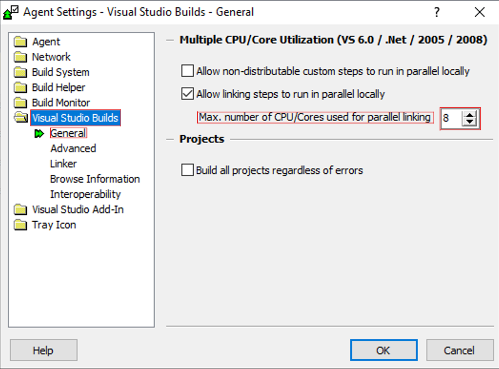
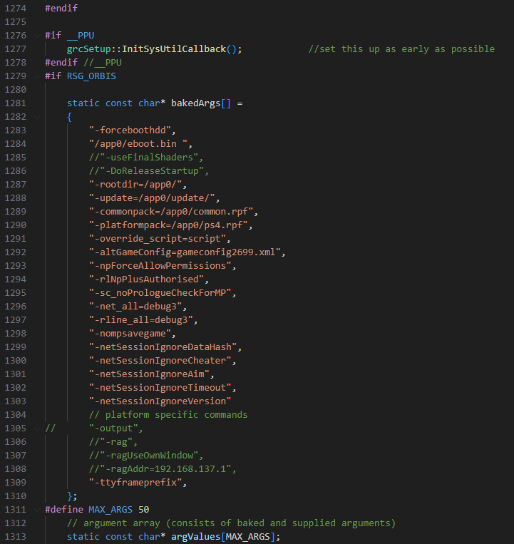

# Grand Theft Auto V: Source Code Build Guide *For PS4*

## Requirements:
- [GTA V for PS4](https://1fichier.com/?owilwri8303p58o3x72u&af=3662447%20) 
    - [Update RPF to v1.46](https://1fichier.com/?xdiqoe5n3c6mqgixa0ns&af=3662447)
- GTAVSP.7z - Source Code  
   - SHA1 Hash: `ca39323730ed644fa534a2946506d4287f92a799`
   - Password: `Mi76#b>9mRed`
- [7-Zip](https://www.7-zip.org/)
- [Visual Studio 2017](https://archive.org/details/VisualStudio2017RTMISOX8664)
- [GTA V Source Code Toolset](https://pixeldrain.com/u/2XdabBq3)
- [VS 2017](https://archive.org/details/VisualStudio2017RTMISOX8664)
- [PS4 SDK 1.200/2.500](https://pixeldrain.com/u/ffVDXJos)
- A Jailbroken PS4 is required for running the build.
   - You can find tutorials by modded warfare on how to do it. 
   - Before you even try this make sure your PS4 Firmware is 9:00-11:00, maybe even 12:00 but not recommended 

## Installing the Toolset

**You should deactivate your Anti-virus protection before doing any of the next steps.**

1. Run `Install_Toolset.bat`

#### Visual Studio 2012

   - At `Optional features to install`: only select `Microsoft Foundation Classes for C++`

#### IncrediBuild

   - At `Welcome` select `Install IncrediBuild`
   - At `Component Selection` select IncrediBuild Agent and IncrediBuild Coordinator
   - Do not change any other settings

#### .Net Framework 3.5

   - If the installer freezes:
     - Go to `Installation_Files\3. .Net Framework 3.5 Installer\Source Files`
     - Copy `setup.bat` to `3. .Net Framework 3.5 Installer` and run it as administrator

#### DirectX SDK (June 2010)

   - If you get `error S1023`:
     - Uninstall Visual C++ 2010 Redistributable
     - Reinstall DirectX SDK (June 2010)
   - At `Help Improve the DirectX SDK` select `No, I would not like to participate`

#### Helix-Core-Server

   - Don't change the port
   - For path, just select any empty folder

## Setup Visual Stuido 2017

  - Make sure to install `.NET desktop development` and `Desktop development with C++`.

## Creating X:\ Drive

1. Create a new folder anywhere you want  
2. Inside the folder, create a folder called `gta5`  
3. Copy all content from `GTAVSP.7z/GTAV Source` folder to `gta5`  
4. Copy the two bat files from the [`GTA V - X Drive Batch files`](GTA%20V%20-%20X%20Drive%20Batch%20Files) folder to your "GTA" folder  
5. Run `Connect_X_Drive.bat`  
6. Right-click on the gta5 folder, turn off the "Read-Only" option, then press "Apply"


## Setup ORBIS SDK
1. Get [`ORBIS SDKs.7z`](https://pixeldrain.com/u/ffVDXJos).
2. Put the `1.700` and `2.500` folders from [`ORBIS SDKs.7z`](https://pixeldrain.com/u/ffVDXJos) in: `C:\Program Files (x86)\SCE\ORBIS SDKs`.
3. Run [`PS4 SDK ENV Installer(run as admin).bat`](GTA%20V%20-%20PS4%20Build%20Required%20Files/GTA%20V%20-%20PS4%20SDK%20Required%20Files/PS4%20SDK%20ENV%20Installer.bat) as administrator.
4. Run [`VsiInstallerPS4.exe`](GTA%20V%20-%20PS4%20Build%20Required%20Files/GTA%20V%20-%20PS4%20SDK%20Required%20Files/VsiInstallerPS4.exe) and select VS2017.

## Patching Source Code and Tools
1. Add all files from [`GTA V - Source Code Patches/PS4/src patches`](GTA%20V%20-%20Source%20Code%20Patches/PS4/src%20patches) to `X:\gta5\src\dev_ng`  
2. Run `X:\gta5\src\dev_ng\Patch_Source.bat`
3. Go to `X:\gta5\src\dev_ng\rage\base\src\system\main.cpp` open the file and search for `bool g_EnableRfs = true;` and change true to `false` then add `"-forceboothdd",`to the launch arguments in line 1283.
4. Copy all folders from [`dll_patches_x.zip`](GTA%20V%20-%20Source%20Code%20Patches/tools%20patch) to `X:\gta5\tools_ng\bin`, ensuring you overwrite existing files.
5. Get [`GTA V - Source Code Patches/PS4/forceinclude/any_types.h`](GTA%20V%20-%20Source%20Code%20Patches/PS4/forceinclude/any_types.h) and put this file in `X:\gta5\src\dev_ng\rage\base\src\forceinclude\templates`.
6. Run `X:\gta5\src\dev_ng\All_In_One_Install_Environment_Variables.bat`  
7. Run `X:\gta5\src\dev_ng\setenv.bat`
8. Run `X:\gta5\src\dev_ng\rage\base\src\forceinclude\templates\makeheaders.bat`.

## Building Binary
1.  Run `X:\gta5\src\dev_ng\game\VS_Project\load_sln_unity_2012.bat` with Visual Studio 2017.
2.  At the top, change from `Win32` to `ORBIS` and use `BankRelease`.

<div style="text-align:center;">

</div>

3. Hold Ctrl key and select all projects under `GameLibs`, `Rage` and `game` folder, right-click 
     and select `Properties`.

<div style="text-align:center;">

</div>

4. Configure Settings:
      -  Inside the `Properties` window in  the `Configuration` drop down and select 
          `All Configurations`.
      - Select `C/C++ >General`, and set `Treat Warnings as Errors` to `No (/WX-)`.
      - For faster compiles set `Multiprocessor Compilation` to `Yes (/MP)` Then click `Apply` and
         `OK`.
      - If you get the error `C1060: Compiler is out of heap space` during build, turn of 
         `Multiprocessor Compilation`.

<div style="text-align:center;">

</div>

 5. At the top of the window, select `Build > Build Solution` and wait for build to finish.

<div style="text-align:center;">

</div>

6. If everything was done correctly, you will get `game_orbis_bankrelease.elf`. 
    - output folder is: `X:\gta5\titleupdate\game_orbis_bankrelease.elf`.

## Building Shaders

Optional: For multicore compilation, go to `X:\gta5\tools_ng\etc\RageShaderManager` and, in all .xml files, change every instance of `SingleCore=` to `"false"`.

1. Run `X:\gta5\src\dev_ng\game\VS_Project\load_sln_unity_2012.bat` with Visual Studio 2017.
2. fter that, switch the platform from `Win32` to `ORBIS`.
3. Under `Shaders`, right click the `shaders_rc` project and click `Rebuild`
- (OPTIONAL) Build low quality shaders
  1. Right click the `shaders_rc` project and click `Properties`
  2. Select `Configuration Properties > NMake`
  3. Under `General`, change all command lines from ending with `win32_40.bat` to ending with `win32_40_lq.bat`, then click `Apply` and `OK`
  4. Rebuild shaders and wait for it to finish

To see the progress and watch its status, in the taskbar, open the Overflow Menu (the small ^ in the taskbar on the right).
Find `IncrediBuild Agent` (the one with a green arrow), right-click it, and press `Build Monitor`.
In `Build Monitor`, on the left press the icon at the top that should say `Progress`.
You should now see what you're building, and at the bottom left of the window, you'll see a percentage of how complete it is out of 100%.

Output folder is `X:\gta5\titleupdate\dev_ng\common\shaders`

#### Known errors:
- If your VM or Computer start lagging, freezing or crashing when trying to build try this:
  - Open `Incredibuild Agent Settings`
  - Under `Visual Studio Builds` / `General` lower the `Max. number of CPU/Cores used for parallel linking`

<div style="text-align:center;">

</div>

## Building Scripts:

1. To build scripts, run this in command prompt  
```batch
X:
cd X:\gta5\src\dev_ng
setenv
cd ..\..\tools_ng\bin\RageScriptEditor
ragScriptEditor
```
2. After the editor launches, select `File > Open Project`
   - Then open `X:\gta5\script\dev_ng\singlesplayer\GTA5_SP.scproj`
3. On the top switch `Windows x86` to `PlayStation 4`.
4. Select `Compiling > Intellibuild > Build Project` and wait until the compiling process finishes 
   - This will take multiple hours, especially in a virtual machine.
   - Output folder is: `X:\gta5\titleupdate\dev_ng\ps4\levels\gta5\script`.

## Patch Game
 - You will need the [Base Game pkg](https://1fichier.com/?owilwri8303p58o3x72u&af=3662447%20) and [Update pkg](https://1fichier.com/?xdiqoe5n3c6mqgixa0ns&af=3662447) on your PC.
 - Make sure you have the unmodifyed [Base Game pkg](https://1fichier.com/?owilwri8303p58o3x72u&af=3662447%20) installed on your PS4.
 - Make sure you dont have any game updates installed.

1. Get the [PS4 Patchbuilder](GTA%20V%20-%20PS4%20Build%20Required%20Files/PS4%20-%20Patchbuilder/Patch%20Builder%20v1.3.3.zip)
   - It is a false positive on Windows Defender so I would disable the Anti Virus or just make an exception for the folder.
2. Extract the Update pkg with PS4 Patch Builder.
   - Run the `Patch Builder v.1.3.3.exe`.
   - On the right side under Package Extraction select the 3 dots and select the Update pkg.
   - Press on `Extract Package`, select all and press Extract.
3. Navigate to extarcted folder and Delete the `sc0` folder.
4. Delete the `Image0\sce_sys` folder.
5. Delete the `Image0\sce_discmap_patch.plt` file.
6. Paste the compiled shaders from `X:\gta5\titleupdate\dev_ng\common\shaders` into `Image0\common\shaders`.
7. Paste the compiled scripts from `X:\gta5\titleupdate\dev_ng\ps4\levels\gta5\script` into `Image0\ps4\levels\gta5\script`.
8. Rename compiled `X:\gta5\titleupdate\game_orbis_bankrelease.elf` to `eboot.bin` and paste it to `Image0`.
9. Place this [`gameconfig2699.xml`](GTA%20V%20-%20PS4%20Build%20Required%20Files/GTA%20V%20-%20Custom%20PS4%20gameconfig2699.xml/gameconfig2699.xml) file in `Image0`. 
10. Place the `common.rpf` from the Base Game pkg file in `Image0`.
   - You can extarct it yourself from the [Base Game pkg](https://1fichier.com/?owilwri8303p58o3x72u&af=3662447%20) or [get it here](GTA%20V%20-%20PS4%20Build%20Required%20Files/GTA%20V%20-%20PS4%20Base%20Game%20common.rpf/common.rpf).
11. Place all 3 folders of [`Update pkg Fixes.7z`](GTA%20V%20-%20PS4%20Build%20Required%20Files/GTA%20V%20-%20PS4%20Update%20pkg%20fixes/Update%20pkg%20Fixes.7z) in `Image0`.

## Compile Update pkg
1. Open PS4 Patch Builder.
2. At `Project Location` open your `Image0` folder.
3. At `Package Settings` open the Base PKG.
4. At `Output` set any empty folder.
5. At `Update Version` enter `1.46`.
*6. Make sure you have at least 100GB free on your drive.*
7 Then rebuild the package with PS4 Patch Builder.
8. Install the modified update pkg on the PS4. 

<div style="text-align:center;">

</div

----------------------------------------------------

## How do the hard coded arguments work?

- They are hard coded in the Eboot.bin 
- The source code stores them in `X:\gta5\src\dev_ng\rage\base\src\system\main.cpp` 
  under line 1283 there you can also add them there (see picture) 
- Always add them at the top and keep the structure.
- You can find a list of them we made [here](GTA%20V%20-%20PS4%20Build%20Required%20Files/GTA%20V%20-%20PS4%20Hardcoded%20Arguments/PS4%20Hardcoded%20Arguments.md). It is probably not all of them.

<div style="text-align:center;">

</div

----------------------------------------------------

## Other Known Issues

### Compileing pkg files Error file could not be opened/written to.
1. Error file could not be opened/written to.
   - You don't have enough space or, The file is corrupt, please extract the file again.

### Network Related Errors in Visual Studio (Optional)
*ONLY DO THIS IF YOU REALLY HAVE NETWORK RELATED ISSUES THESE ARE RARE*

1. Download the [Network Fix](GTA%20V%20-%20Source%20Code%20Patches/network%20fix%20(optional)).

2. Find out your IPv4 Address:
- **In Windows 11**: 
  Settings → Network & Internet → Advanced Network Settings. Select the Network Adapter you're using and press **View Additional Properties**.  
  Note down your IPv4 Address.

- **In Windows 10**:  
  Navigate to Settings → Network & Internet → Change Adapter Options. Select the Network Adapter you're using, right-click it, and press **Details**.  
  Note down your IPv4 Address.

3. Replace `PUT-IP-HERE` with your IPv4 Address in `studios.meta` and `rag.meta`
4. Move `studios.meta` and `rag.meta` to `X:\gta5\tools_ng\etc\globals`

### Broken Render Distance - This is due to some errors in the render distance code but if you are a decent coder, you could fix it.

----------------------------------------------------

## Running Rag

 Running rag in this build is possible and all platforms that the source code compiles for but in the moment i dont have a guide for PS4. Please reach out to [Sorynx](https://github.com/Dbz9) or [our server](https://discord.gg/YaqC9aqrsx) on discord for help running it 


 ----------------------------------------------------
